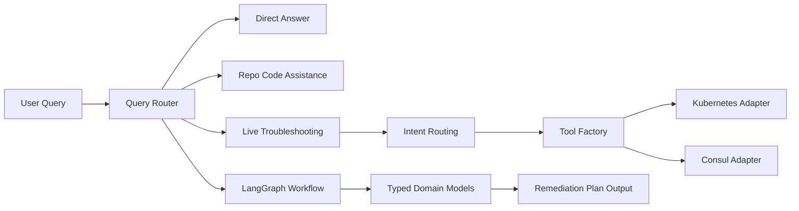

# meshtrbl

AI-powered troubleshooting assistant for Kubernetes and Consul service mesh.

[](https://github.com/chris-lovett/meshtrbl)
[](https://www.python.org/downloads/)
[](https://github.com/chris-lovett/meshtrbl)
[](LICENSE)
[](https://www.langchain.com/)
[](https://www.langchain.com/langgraph)

meshtrbl combines LangChain agents, LangGraph workflows, and practical cluster tooling to help operators move from symptoms to actionable remediation quickly.

## 90-Second Demo

Run this exact flow from a fresh terminal:

```bash
cd meshtrbl
source venv/bin/activate
export OPENAI_API_KEY="<your-key>"
meshtrbl --query "pod payments-api is CrashLoopBackOff in production; give root cause and next 3 actions"
meshtrbl --query "can service checkout talk to postgres in consul mesh"
```

Expected outcome in under 90 seconds:

- First command returns a targeted pod diagnosis and remediation sequence.
- Second command validates mesh connectivity/intentions for a concrete service path.

## Screenshot and GIF

Terminal screenshot:


Animated walkthrough:


Tip: keep images under `docs/assets/` so links remain stable across branches and releases.

## Why meshtrbl

- Focused on real operations troubleshooting, not generic chat.
- Supports Kubernetes diagnostics and Consul service mesh investigation.
- Uses intent routing and session caching for faster common-path responses.
- Includes workflow-based diagnostics for multi-step, cross-component incidents.
- Ships as a CLI with interactive mode and single-query mode.

## Core Capabilities

- Kubernetes diagnostics: pod status, logs, listing, and detailed inspection.
- Consul diagnostics: service health, instances, intentions, and member status.
- Conversation memory for contextual follow-up questions.
- Error pattern recognition for faster issue triage.
- Intent classification and fast-path execution for common issue types.
- Session-scoped cache with visibility and cache controls.
- Typed diagnostics and remediation models in workflow paths.

## Architecture Snapshot



## Quick Start

### 1) Prerequisites

- Python 3.9+
- Access to a Kubernetes cluster (recommended)
- Access to a Consul cluster (optional, for Consul features)
- OpenAI API key

macOS recommendation:
- Use Homebrew Python instead of Command Line Tools Python to avoid SSL/runtime surprises.

### 2) Install

```bash
cd meshtrbl

# Optional on macOS
brew install python@3.11

/opt/homebrew/bin/python3.11 -m venv venv
source venv/bin/activate

python -m pip install --upgrade pip
pip install ".[all]"
```

### 3) Configure

```bash
cp .env.example .env
```

Required:

```bash
OPENAI_API_KEY=your_openai_api_key_here
```

Common optional settings:

```bash
K8S_NAMESPACE=default
CONSUL_HTTP_ADDR=127.0.0.1:8500
CONSUL_HTTP_TOKEN=
CONSUL_HTTP_SSL=false
CONSUL_HTTP_SSL_VERIFY=true
CONSUL_CACERT=
LLM_MODEL=gpt-4o-mini
```

Important Consul note:
- CONSUL_HTTP_ADDR must be host:port without protocol prefix.

## Run

Interactive mode:

```bash
meshtrbl
```

Equivalent module invocation:

```bash
python -m src.agent
```

Single query mode:

```bash
meshtrbl --query "Why is my pod in CrashLoopBackOff?"
```

Run setup wizard:

```bash
meshtrbl --setup
```

Useful runtime flags:

```bash
meshtrbl --namespace production --verbose
meshtrbl --consul-host consul.example.com --consul-port 8500
meshtrbl --no-memory --no-intent-routing --no-cache
meshtrbl --cache-ttl 600 --cache-size 200
meshtrbl --max-iterations 50 --max-time 420
meshtrbl --no-health-check
```

## Interactive Commands

When running in interactive mode:

- /help show available commands
- /examples show sample troubleshooting prompts
- /clear clear conversation memory
- /history show conversation history
- /summary show conversation summary
- /cache show cache statistics
- /clearcache clear session cache
- exit or quit end session

## Example Prompts

- "My pod web-app-7d8f9c keeps restarting. What should I check first?"
- "Can service api talk to database in Consul mesh right now?"
- "Show likely root causes for intermittent 503s between frontend and checkout."
- "Summarize what we already tried and suggest the next 3 diagnostics."

## Documentation

Start here:

- docs/QUICKSTART.md
- docs/INSTALL.md
- docs/PHASE3_LANGGRAPH_WORKFLOWS.md

Feature deep dives:

- docs/MEMORY_FEATURE.md
- docs/ERROR_PATTERN_RECOGNITION.md
- docs/INTENT_ROUTING_FEATURE.md
- docs/SESSION_CACHE_FEATURE.md
- docs/CONSUL_CONNECT_FEATURE.md
- docs/SERVICE_COMMUNICATION_FEATURE.md

## Development

Run tests:

```bash
python -m pytest -q
```

Targeted suite used in recent refactor validation:

```bash
python -m pytest -q \
  tests/test_agent.py \
  tests/test_workflows.py \
  tests/test_core_settings_router.py \
  tests/test_query_orchestrator.py \
  tests/test_llm_runtime_service.py \
  tests/test_chat_session_service.py \
  tests/test_domain_models.py
```

## Project Layout

```text
src/
  agent.py
  application/
  core/
  domain/
    models/
  infrastructure/
    adapters/
  prompts/
  tools/
  workflows/
tests/
docs/
```

## License

MIT
