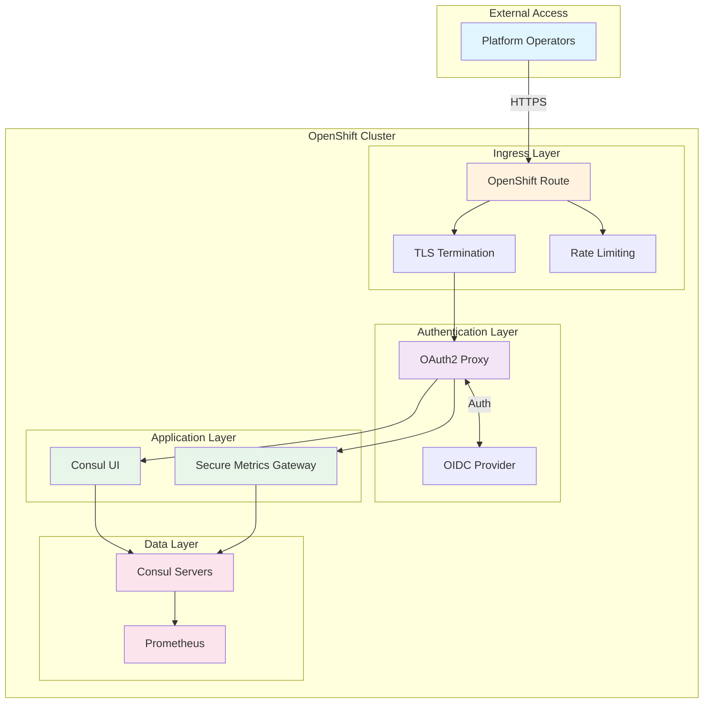
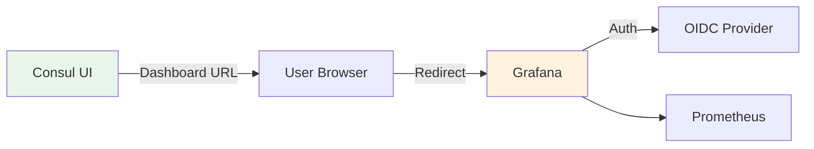
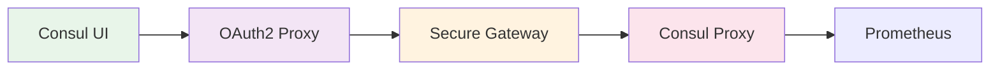

# Consul UI Secure Enterprise Deployment Guide

## Welcome

This comprehensive guide provides production-ready deployment instructions for the Consul UI with enterprise-grade security controls, specifically designed for platform operators in regulated industries where security and compliance are top priorities.

!!! success "Target Audience"
    Platform operators and security teams in regulated environments (Financial Services, Healthcare, Government, etc.)

!!! info "Environment Specifications"
    - **Consul Version**: Enterprise 1.21+
    - **Platform**: OpenShift 4.19+ (on-premises)
    - **Security Level**: Enterprise-grade / Regulated Industries

---

## Key Features

### 🔒 Enterprise Security

- **Multi-layered Authentication**: OIDC/SAML with MFA
- **Zero Trust Architecture**: Defense-in-depth security model
- **Encryption Everywhere**: TLS 1.3 for all communications
- **Comprehensive Audit Logging**: Full compliance trail

### 📊 UI Capabilities

- **Service Topology Visualization**: Real-time service mesh graph
- **Metrics Dashboards**: Integrated performance monitoring
- **Service Catalog**: Complete service discovery interface
- **ACL Management**: Role-based access control UI

### ✅ Compliance Ready

- **SOC 2 Type II**: Complete audit controls
- **PCI DSS**: Payment card industry standards
- **GDPR**: Data protection compliance
- **HIPAA**: Healthcare data security
- **SOX**: Financial reporting controls

---

## Quick Navigation

<div class="grid cards" markdown>

-   :material-clock-fast:{ .lg .middle } __Quick Start__

    ---

    Get up and running in minutes with our quick start guide

    [:octicons-arrow-right-24: Quick Start](getting-started/quickstart.md)

-   :material-shield-lock:{ .lg .middle } __Security Model__

    ---

    Understand the comprehensive security architecture

    [:octicons-arrow-right-24: Security Overview](security/overview.md)

-   :material-rocket-launch:{ .lg .middle } __Deployment__

    ---

    Step-by-step deployment instructions

    [:octicons-arrow-right-24: Deploy Now](deployment/overview.md)

-   :material-cog:{ .lg .middle } __Configuration__

    ---

    Detailed configuration references and examples

    [:octicons-arrow-right-24: Configure](configuration/helm-values.md)

</div>

---

## Architecture Overview



---

## Security Highlights

!!! warning "Critical Security Features"
    This deployment implements **defense-in-depth** security with multiple layers:

### Layer 1: Network Security
- Network segmentation with OpenShift Network Policies
- mTLS between all components
- No direct internet exposure
- Firewall rules at infrastructure level

### Layer 2: Authentication
- OIDC/SAML integration with corporate IdP
- Multi-factor authentication (MFA) required
- Short-lived tokens (max 8 hours)
- Automated session management

### Layer 3: Authorization
- Role-based access control (RBAC)
- Principle of least privilege
- Namespace isolation (Enterprise)
- Fine-grained ACL policies

### Layer 4: Data Protection
- TLS 1.3 encryption in transit
- Encryption at rest for Consul data
- Secrets management via OpenShift Secrets/Vault
- No sensitive data in logs

### Layer 5: Audit & Monitoring
- Comprehensive audit logging
- Real-time security monitoring
- Anomaly detection
- SIEM integration

---

## Metrics Deployment Options

This guide provides **three approaches** for metrics integration:

### Option A: Direct Grafana Integration ⭐ RECOMMENDED



**Benefits:**
- ✅ Lowest security risk
- ✅ Separate authentication
- ✅ Best compliance posture
- ✅ Easiest to audit

[:octicons-arrow-right-24: Learn More](architecture/metrics-proxy.md#option-a-direct-grafana-integration)

### Option B: Secure Metrics Gateway



**Benefits:**
- ✅ Defense-in-depth security
- ✅ Multiple authentication layers
- ✅ Comprehensive audit trail
- ✅ Production-ready

[:octicons-arrow-right-24: Learn More](deployment/secure-metrics-gateway.md)

### Option C: Built-in Proxy (Not Recommended)

!!! danger "Security Warning"
    The built-in metrics proxy is **NOT recommended for production** in regulated environments due to security concerns. See [Metrics Proxy Architecture](architecture/metrics-proxy.md) for details.

---

## Compliance Framework

This deployment meets requirements for:

| Framework | Requirements Met | Documentation |
|-----------|-----------------|---------------|
| **SOC 2 Type II** | Access controls, audit logging, encryption | [Audit & Compliance](security/audit-compliance.md) |
| **PCI DSS** | Network segmentation, access logging, encryption | [Security Overview](security/overview.md) |
| **GDPR** | Data protection, access controls, audit trails | [Data Protection](security/encryption.md) |
| **HIPAA** | PHI protection, access controls, audit logging | [Security Checklist](security/checklist.md) |
| **SOX** | Change management, audit trails, access controls | [Operations](operations/monitoring.md) |

---

## Getting Started

### Prerequisites

Before you begin, ensure you have:

- [x] OpenShift 4.19+ cluster
- [x] Consul Enterprise 1.21+ license
- [x] Internal PKI/CA infrastructure
- [x] OIDC-compatible Identity Provider
- [x] Cluster-admin access

[:octicons-arrow-right-24: View Full Prerequisites](getting-started/prerequisites.md)

### Quick Start

```bash
# 1. Clone the repository
git clone https://github.com/your-org/consul-ui-secure-deployment
cd consul-ui-secure-deployment

# 2. Review and customize configuration
vi docs/helm-values-secure-ui.yaml

# 3. Deploy Consul with secure UI
./scripts/deploy-consul.sh

# 4. Validate deployment
./scripts/validate-deployment.sh
```

[:octicons-arrow-right-24: Detailed Quick Start Guide](getting-started/quickstart.md)

---

## Documentation Structure

### 📚 Main Sections

- **[Getting Started](getting-started/overview.md)**: Prerequisites, quick start, and initial setup
- **[Architecture](architecture/overview.md)**: System design, security model, and network topology
- **[Security](security/overview.md)**: Comprehensive security controls and compliance
- **[Deployment](deployment/overview.md)**: Step-by-step deployment instructions
- **[Configuration](configuration/helm-values.md)**: Detailed configuration references
- **[Operations](operations/monitoring.md)**: Day-2 operations, monitoring, and maintenance
- **[Reference](reference/api.md)**: API docs, CLI commands, and configuration reference
- **[Appendix](appendix/examples.md)**: Examples, scripts, and additional resources

---

## Support & Resources

### Official Documentation

- [Consul Documentation](https://developer.hashicorp.com/consul)
- [Consul on Kubernetes](https://developer.hashicorp.com/consul/docs/k8s)
- [Consul Security](https://developer.hashicorp.com/consul/docs/security)

### Community

- [HashiCorp Discuss](https://discuss.hashicorp.com/c/consul)
- [GitHub Issues](https://github.com/hashicorp/consul/issues)
- [Consul Learn Tutorials](https://developer.hashicorp.com/consul/tutorials)

### Professional Services

For enterprise support and professional services:

- [HashiCorp Support](https://support.hashicorp.com)
- [HashiCorp Professional Services](https://www.hashicorp.com/services)

---

## Contributing

We welcome contributions! Please see our [Contributing Guidelines](appendix/resources.md#contributing) for details.

---

## License

This documentation is provided under the [MIT License](LICENSE).

---

<div class="grid cards" markdown>

-   :material-security:{ .lg .middle } __Security First__

    ---

    Built with enterprise-grade security from the ground up

-   :material-check-decagram:{ .lg .middle } __Compliance Ready__

    ---

    Meets SOC 2, PCI DSS, GDPR, HIPAA, and SOX requirements

-   :material-scale-balance:{ .lg .middle } __Production Tested__

    ---

    Battle-tested in regulated production environments

-   :material-update:{ .lg .middle } __Actively Maintained__

    ---

    Regular updates for latest Consul versions and security patches

</div>

---

**Ready to get started?** Head over to the [Quick Start Guide](getting-started/quickstart.md) or dive into the [Architecture Overview](architecture/overview.md).